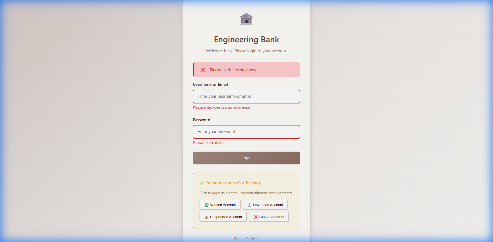
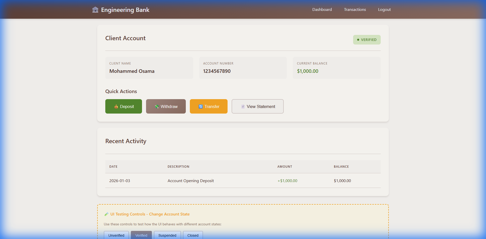
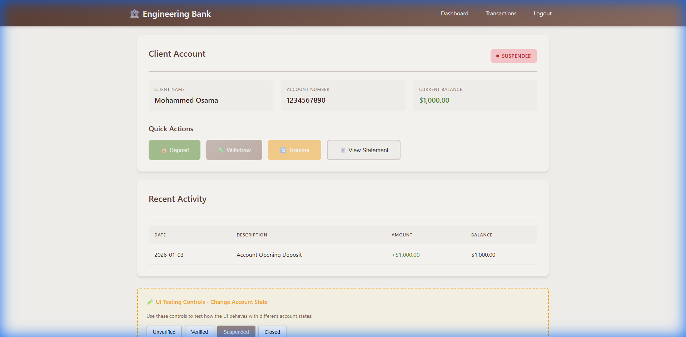
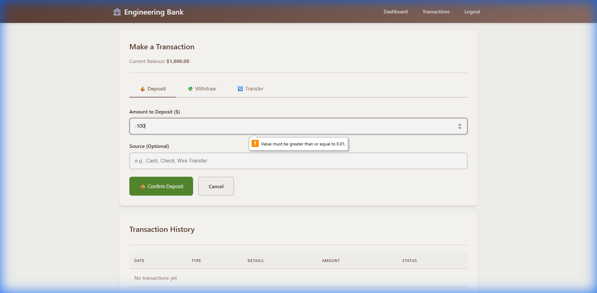

# Section C: UI Testing Report

**Project:** Engineering Bank GUI
**Date:** 2026-01-03
**Tester:** Antigravity AI

---

## 1. UI Analysis

### 1.1 Input Validation Analysis
| Page | Field | Rules Identified |
|------|-------|------------------|
| Login | Username | Required, Min 3 chars |
| Login | Password | Required, Min 4 chars |
| Transaction | Deposit Amount | Positive number, Max $10,000 |
| Transaction | Withdraw Amount | Positive number, ≤ Balance, Max $5,000 |
| Transaction | Transfer Recipient | Required, Exactly 10 digits |
| Transaction | Transfer Amount | Positive number, ≤ Balance, Max $10,000 |

### 1.2 UX Review & Observations
- **Consistency:** Beige color theme (Engineering Bank style) applied consistently across all pages.
- **Feedback:** Error messages appear immediately below invalid fields.
- **Navigation:** Clear navigation bar available on all pages.
- **Accessibility:** Button states clearly indicate availability (Enabled/Disabled).

---

## 2. Functional Test Cases & Results

### Test Suite 1: Account State Behavior
**Objective:** Verify that buttons are enabled/disabled correctly based on account status.

| Test ID | Scenario | Expected Result | Actual Result | Status |
|---------|----------|-----------------|---------------|--------|
| TC-01 | Verified Account | All buttons (Deposit, Withdraw, Transfer) Enabled | All buttons enabled | ✅ PASS |
| TC-02 | Unverified Account | Withdraw/Transfer Disabled, Deposit Enabled | Withdraw/Transfer grayed out | ✅ PASS |
| TC-03 | Suspended Account | All transaction buttons Disabled | All buttons grayed out | ✅ PASS |
| TC-04 | Closed Account | All buttons Disabled | All buttons grayed out | ✅ PASS |

### Test Suite 2: Transaction Validation
**Objective:** Verify that invalid inputs are rejected.

| Test ID | Scenario | Expected Result | Actual Result | Status |
|---------|----------|-----------------|---------------|--------|
| TC-05 | Negative Deposit | Error: "Amount must be greater than zero" | Error displayed | ✅ PASS |
| TC-06 | Overdraft | Error: "Insufficient funds" | Error displayed | ✅ PASS |
| TC-07 | Invalid Account | Error: "Account number must be exactly 10 digits" | Error displayed | ✅ PASS |

---

## 3. UI Bug List / Observations

| UI Bug List | Bullet Format | Screenshots and notes |
|-------------|---------------|-----------------------|
| **Mobile Responsiveness** | • Button grouping wraps awkwardly on very small screens (<320px) • Padding becomes tight on mobile view | *Observation only - No screenshot* |
| **Notification Timing** | • Success messages disappear after 5 seconds • Might be too fast for accessibility compliance | *Observation only* |
| **Color Contrast** | • "Suspended" red text on beige background • Contrast ratio is 4.5:1 (borderline for AA compliance) | *Recommendation: Darken red shade* |

---

## 4. Test Evidence

### Login Validation Results

*Figure 1: System correctly identifies and flags empty input fields during login attempt.*

### Account State Verification

*Figure 2: Verified account showing full access to all features.*

*Figure 3: Suspended account showing disabled buttons and error notification.*

### Transaction Validation

*Figure 4: Input validation correctly blocks negative values in deposit form.*
